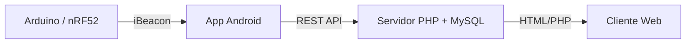

# Proyecto de Biometría – IoT con iBeacon, Android y Servidor Web

Este proyecto integra **sensores IoT con BLE (iBeacon)**, una **aplicación Android**, un **servidor web en PHP/MySQL** y un **cliente HTML** para visualizar los datos.

El objetivo es mostrar cómo un dispositivo embebido (Arduino/nRF52) puede publicar mediciones (ej. CO₂, temperatura) mediante **iBeacon**, ser detectado por un móvil Android, almacenado en una base de datos y consultado desde un cliente web.

---

## 📂 Estructura del repositorio

```
src/
 ├── arduino/         # Código embebido (nRF52 / Arduino)
 │    ├── HolaMundoIBeacon.ino
 │    ├── Medidor.h
 │    ├── LED.h
 │    ├── EmisoraBLE.h
 │    ├── ServicioEnEmisora.h
 │    ├── Publicador.h
 │    └── PuertoSerie.h
 │
 ├── phone/           # Aplicación Android (Java)
 │    ├── MainActivity.java
 │    ├── Device.java
 │    ├── TramaIBeacon.java
 │    ├── ApiService.java
 │    ├── ApiResponse.java
 │    └── Utilidades.java
 │
 ├── server/          # Servidor PHP + MySQL
 │    ├── db.php
 │    ├── dispositivos.php
 │    └── insert_device.php
 │
 └── client/          # Cliente web (HTML/Bootstrap)
      └── index.html
```

---

## ⚙️ Arduino (Emisor BLE)

El código en `arduino/` implementa un **beacon BLE (iBeacon)** que publica mediciones simuladas de **CO₂ y temperatura**.

* `Medidor.h` → simula sensores (CO₂, temperatura).
* `LED.h` → control de LEDs de estado.
* `PuertoSerie.h` → wrapper para la depuración vía Serial.
* `EmisoraBLE.h` → gestión de publicidad iBeacon.
* `ServicioEnEmisora.h` → definición de servicios/características BLE.
* `Publicador.h` → encapsula la lógica de publicación (CO₂, temperatura).
* `HolaMundoIBeacon.ino` → programa principal, inicializa emisora y publica periódicamente.

👉 Los datos se transmiten en los campos `major` y `minor` de la trama iBeacon.

---

## 📱 Aplicación Android

La aplicación Android se encarga de escanear beacons, procesarlos y enviar sus datos al servidor mediante HTTP/REST.

* `MainActivity.java` → interfaz principal y lógica de escaneo BLE.
* `Device.java` → modelo de dispositivo BLE detectado.
* `TramaIBeacon.java` → parseo de la trama iBeacon recibida.
* `ApiService.java` → cliente HTTP para enviar datos al servidor.
* `ApiResponse.java` → modelo de respuesta del servidor.
* `Utilidades.java` → funciones auxiliares (parseo, formato, etc.).

👉 Flujo de funcionamiento:

1. La app detecta los beacons cercanos.
2. Parsea UUID, major, minor y RSSI.
3. Envía los datos al servidor (`insert_device.php`).

---

## 🌐 Servidor PHP + MySQL

El servidor recibe y almacena los datos enviados por la aplicación Android.

* `db.php` → conexión a la base de datos MySQL.
* `insert_device.php` → endpoint REST para insertar dispositivos.
* `dispositivos.php` → página que lista los dispositivos registrados.

👉 Base de datos de ejemplo:

```sql
CREATE TABLE dispositivos (
  id INT AUTO_INCREMENT PRIMARY KEY,
  uuid VARCHAR(64),
  major INT,
  minor INT,
  rssi INT,
  fecha TIMESTAMP DEFAULT CURRENT_TIMESTAMP
);
```

---

## 💻 Cliente Web

El cliente HTML permite visualizar los dispositivos almacenados en la base de datos.

Ejemplo (`client/index.html`):

```html
<!doctype html>
<html lang="es">
<head>
  <meta charset="utf-8">
  <title>Dispositivos IoT</title>
  <link href="https://cdn.jsdelivr.net/npm/bootstrap@5.3.3/dist/css/bootstrap.min.css" rel="stylesheet">
</head>
<body class="container mt-4">
  <h1>Dispositivos Registrados</h1>
  <iframe src="../server/dispositivos.php" width="100%" height="500"></iframe>
</body>
</html>
```

---

## 📊 Arquitectura del sistema



1. **Arduino** emite beacons con valores de sensores.
2. **Android** detecta y procesa las tramas iBeacon.
3. Envía los datos al **servidor** mediante API REST (PHP/MySQL).
4. El **cliente web** permite visualizar los dispositivos registrados.

---

## 🚀 Instalación y uso

### Arduino

1. Instalar **Arduino IDE**.
2. Instalar la librería **Adafruit nRF52 Bluefruit**.
3. Subir `HolaMundoIBeacon.ino` al microcontrolador.
4. Verificar anuncios BLE con aplicaciones como **nRF Connect**.

### Servidor

1. Instalar **XAMPP/LAMP**.
2. Crear la base de datos en MySQL e importar la tabla `dispositivos`.
3. Copiar la carpeta `server/` en `htdocs/` (Windows) o `/var/www/html/` (Linux).

### Android

1. Abrir `phone/` en **Android Studio**.
2. Configurar permisos de Bluetooth y ubicación.
3. Compilar y ejecutar en un dispositivo con BLE.

### Cliente Web

1. Abrir `client/index.html` en un navegador.
2. Ver la lista de dispositivos obtenida desde `dispositivos.php`.

---

## 📖 Licencia

Este proyecto se distribuye bajo la licencia **MIT**, para fines educativos e investigativos.

---

## 👨‍💻 Autores

* Inspirado en el trabajo de **Jordi Bataller i Mascarell** y adaptado para un proyecto académico IoT.
